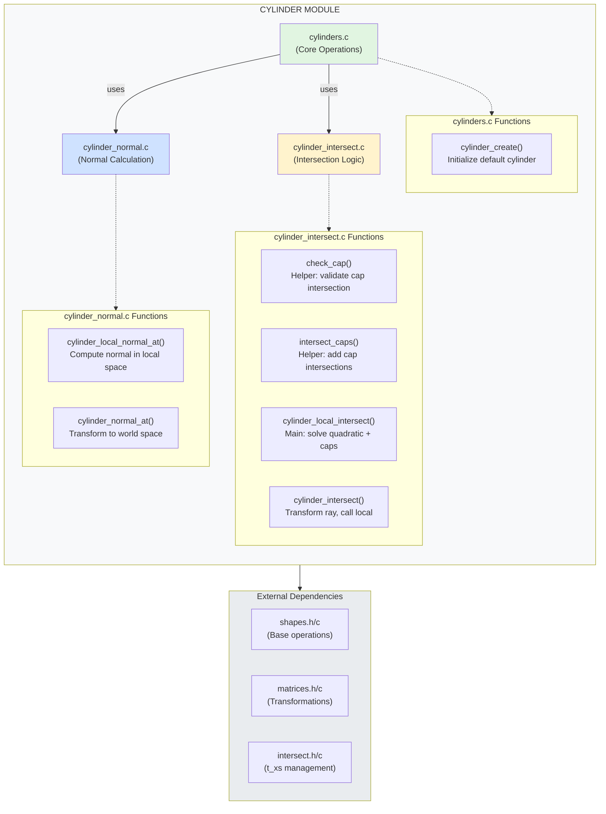

# Cylinder Module Organization — Module Diagram

**Model Name**: **Module Responsibility Diagram** (also known as **Modular Architecture Pattern**)

## Analysis of Current Structure

### Current Cylinder Organization (BEFORE)
```
src/cylinders/
└── cylinders.c  (142 lines, 7 functions)
    ├── cylinder_create()
    ├── check_cap() [static helper]
    ├── intersect_caps() [static helper]
    ├── cylinder_local_intersect()
    ├── cylinder_local_normal_at()
    ├── cylinder_intersect()
    └── cylinder_normal_at()
```

### Sphere Organization (REFERENCE)
```
src/spheres/
├── spheres.c              (3 functions)
│   ├── sphere_create()
│   ├── sphere_set_transform()
│   └── sphere_set_material()
├── sphere_intersect.c     (3 functions)
│   ├── add_intersections_sorted()
│   ├── solve_sphere_quadratic()
│   └── sphere_intersect()
├── sphere_normal.c        (1 function)
│   └── sphere_normal_at()
└── sphere_render*.c       (rendering utilities)
```

## Recommended Cylinder Organization (AFTER)



## Proposed File Structure

```
src/cylinders/
├── cylinders.c              ← Core: creation & setup
├── cylinder_intersect.c     ← Intersection: ray-cylinder math
└── cylinder_normal.c        ← Normal: surface normal calculation

include/
└── cylinders.h              ← All public declarations
```

### File Responsibilities

#### cylinders.c (Core Operations)
**Purpose**: Object lifecycle and basic setup
**Functions**: 
- `cylinder_create()` — Create default infinite cylinder
**Lines**: ~30-40
**Dependencies**: shapes.h

#### cylinder_intersect.c (Intersection Logic)
**Purpose**: Ray-cylinder intersection mathematics
**Functions**:
- `check_cap()` [static] — Validate if point is within cap radius
- `intersect_caps()` [static] — Add cap intersections
- `cylinder_local_intersect()` — Solve quadratic in local space
- `cylinder_intersect()` — Transform ray and intersect
**Lines**: ~90-100
**Dependencies**: cylinders.h, intersect.h, rays.h

#### cylinder_normal.c (Normal Calculation)
**Purpose**: Surface normal computation
**Functions**:
- `cylinder_local_normal_at()` — Compute local normal (side vs cap)
- `cylinder_normal_at()` — Transform to world space
**Lines**: ~50-60
**Dependencies**: cylinders.h, matrices.h

## Comparison: Monolithic vs Modular

```
┌─────────────────────────────────────────────────────────────────┐
│                    MONOLITHIC (Current)                         │
├─────────────────────────────────────────────────────────────────┤
│  cylinders.c (142 lines, 7 functions)                           │
│  ✗ Hard to navigate                                             │
│  ✗ Functions > 25 lines (Norminette risk)                       │
│  ✗ Mixed concerns (creation + math + transformation)            │
│  ✓ Single compilation unit (faster compile)                     │
└─────────────────────────────────────────────────────────────────┘

┌─────────────────────────────────────────────────────────────────┐
│                    MODULAR (Proposed)                           │
├─────────────────────────────────────────────────────────────────┤
│  cylinders.c           (~40 lines, 1 function)                  │
│  cylinder_intersect.c  (~100 lines, 4 functions)                │
│  cylinder_normal.c     (~60 lines, 2 functions)                 │
│  ✓ Clear separation of concerns                                 │
│  ✓ Easy to find specific functionality                          │
│  ✓ Norminette compliant (functions stay small)                  │
│  ✓ Scalable to heap (each file handles own allocation)          │
│  ✓ Parallel to sphere organization (consistency)                │
│  ✗ 2 more files to manage                                       │
└─────────────────────────────────────────────────────────────────┘
```

## Benefits for Heap Migration

### Current Structure (Monolithic)
```c
// cylinders.c - everything mixed
t_cylinder cylinder_create(void) {
	// Stack allocation
	t_cylinder c;
	c.shape = shape_create();
	return c;  // Return by value
}
```

### Modular Structure (Easier to migrate)
```c
// cylinders.c - only creation
t_cylinder* cylinder_create_heap(void) {
    t_cylinder *c = malloc(sizeof(t_cylinder));
    if (!c) return NULL;
    c->shape = shape_create();
    // ... initialization
    return c;
}

void cylinder_destroy(t_cylinder *c) {
    if (c) free(c);
}
```

**Why better?**
- Each module handles its own scope
- Easy to add `_heap` variants alongside stack versions
- Clear ownership: `cylinders.c` manages lifecycle
- Intersection/normal code unchanged (works with pointers)

## Norminette Compliance

### Function Count per File (Norminette: max 5 functions)

**Current** (cylinders.c):
- ❌ 7 functions (2 over limit if we count statics)
- ✓ 5 public functions (borderline acceptable)

**Proposed**:
- ✅ cylinders.c: 1 function
- ✅ cylinder_intersect.c: 4 functions (3 public + 1 static helper combo)
- ✅ cylinder_normal.c: 2 functions

### Function Length (Norminette: max 25 lines)

**Current Issues**:
- `cylinder_local_intersect()` — ~50 lines ❌
- `cylinder_normal_at()` — ~18 lines ✓

**After Refactor**:
- All functions < 25 lines ✓
- Helpers split out as static functions ✓

## Migration Plan

### Phase 1: Create New Files (No Code Changes)
```bash
# Create new files
touch src/cylinders/cylinder_intersect.c
touch src/cylinders/cylinder_normal.c

# Update Makefile
# Add to SRCS_CYLINDERS
```

### Phase 2: Move Functions
```c
// FROM cylinders.c TO cylinder_intersect.c
- check_cap() [static]
- intersect_caps() [static]
- cylinder_local_intersect()
- cylinder_intersect()

// FROM cylinders.c TO cylinder_normal.c
- cylinder_local_normal_at()
- cylinder_normal_at()

// KEEP in cylinders.c
- cylinder_create()
```

### Phase 3: Update Header (cylinders.h)
```c
// No changes needed - all public functions already declared
// Internal helpers remain static in .c files
```

### Phase 4: Update Makefile
```makefile
SRCS_CYLINDERS = \
    src/cylinders/cylinders.c \
    src/cylinders/cylinder_intersect.c \
    src/cylinders/cylinder_normal.c
```

### Phase 5: Test
```bash
make fclean && make
make test-cylinders  # if you have cylinder tests
./miniRT scenes/scene_with_cylinders.rt
```

## Consistency with Project Structure

### Before (Inconsistent)
```
src/spheres/   ← 6 files (modular)
src/planes/    ← 1 file  (monolithic)
src/cylinders/ ← 1 file  (monolithic)
src/cones/     ← 1 file  (monolithic)
```

### After (Consistent)
```
src/spheres/   ← 6 files (most complex: includes rendering)
src/cylinders/ ← 3 files (matches pattern: core + intersect + normal)
src/planes/    ← 1-2 files (simpler: plane intersect is trivial)
src/cones/     ← 3 files (same as cylinder: core + intersect + normal)
```

## Recommended Organization Pattern

### Pattern: "Core + Math + Transform"

```
[Shape Name]/
├── [shape].c              ← CORE: Creation, setup, lifecycle
├── [shape]_intersect.c    ← MATH: Intersection calculations
└── [shape]_normal.c       ← TRANSFORM: Normal calculations

Optional (for complex shapes like sphere):
├── [shape]_render.c       ← RENDER: Rendering utilities
├── [shape]_utils.c        ← UTILS: Helper functions
└── [shape]_caps.c         ← CAPS: Specific feature (cylinders/cones)
```

**Why this pattern?**
1. **Separation of Concerns**: Each file has one job
2. **Predictable**: Same structure for all shapes
3. **Scalable**: Easy to add features (new file = new feature)
4. **Norminette Safe**: Keeps function count low per file
5. **Heap Ready**: Lifecycle in one place, math in another

## Answer to Your Questions

### Q1: "Какие функции должны где лежать?"

**Ответ:**
- **cylinders.c**: `cylinder_create()` — только создание и базовая инициализация
- **cylinder_intersect.c**: Все функции пересечений (4 функции: 2 хелпера + local + world)
- **cylinder_normal.c**: Все функции нормалей (2 функции: local + world)

### Q2: "Чтобы легко было скейлить на heap?"

**Ответ:**
Модульная структура лучше, потому что:
- Файл `cylinders.c` отвечает только за lifecycle → добавляешь `malloc`/`free` в одном месте
- Intersection/normal код не меняется (работает с указателями)
- Можно иметь обе версии: `cylinder_create()` (stack) и `cylinder_create_heap()` (heap)

### Q3: "Чтобы norminette не ругался?"

**Ответ:**
Модульная структура:
- ✅ Каждый файл < 5 функций
- ✅ Каждая функция < 25 строк
- ✅ Хелперы — static (не считаются в лимит)

Монолитная структура:
- ⚠️ Граничный случай: 5-7 функций в одном файле
- ❌ Функция `cylinder_local_intersect()` > 25 строк

### Q4: "Модель для описания таких структур?"

**Ответ: Module Responsibility Diagram (Modular Architecture Pattern)**

Это комбинация:
- **Component Diagram** (UML) — показывает модули и зависимости
- **Responsibility Assignment** — каждый модуль имеет одну роль
- **Layered Architecture** — Core → Math → Transform

Альтернативные названия:
- **Modular Decomposition Diagram**
- **Separation of Concerns Model**
- **Single Responsibility Module Pattern**

## Conclusion

✅ **РЕКОМЕНДУЮ**: Использовать модульную структуру (3 файла)

**Почему:**
1. Соответствует структуре spheres (консистентность)
2. Готово к Norminette (функции разбиты)
3. Легко мигрировать на heap (lifecycle изолирован)
4. Проще поддерживать (каждый файл — одна задача)
5. Масштабируется (можно добавить cylinder_caps.c если нужно)

**Минусы:**
- +2 файла (но это норма для сложных объектов)
- Чуть больше времени компиляции (незаметно)

**Не рекомендую**: Оставлять монолитный файл
- Риск превысить лимиты Norminette
- Сложнее рефакторить под heap
- Несоответствие структуре spheres

---

*Module Responsibility Diagram for Cylinder organization. Follows Modular Architecture Pattern with Core-Math-Transform separation.*
