# Cone Support Documentation

## Overview
Cone rendering support allows creating conical objects in 3D scenes. Cones are defined by a base center, axis direction, diameter, and height. This is a bonus feature that extends the mandatory shapes (sphere, plane, cylinder).

## Architecture

### Data Flow
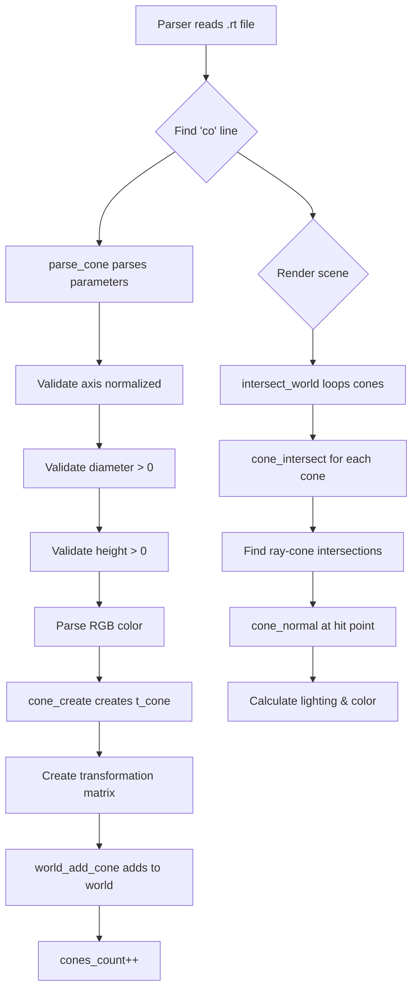

### Cone Structure
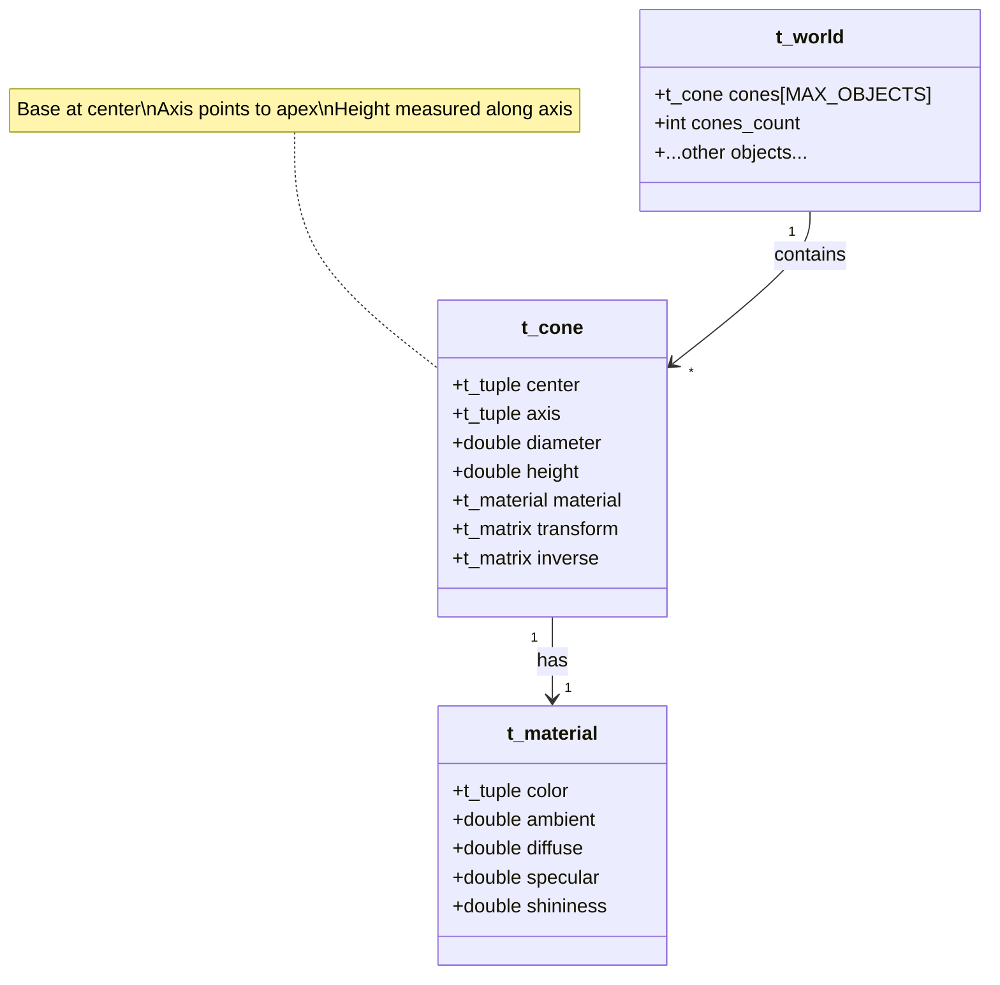

### Cone Geometry
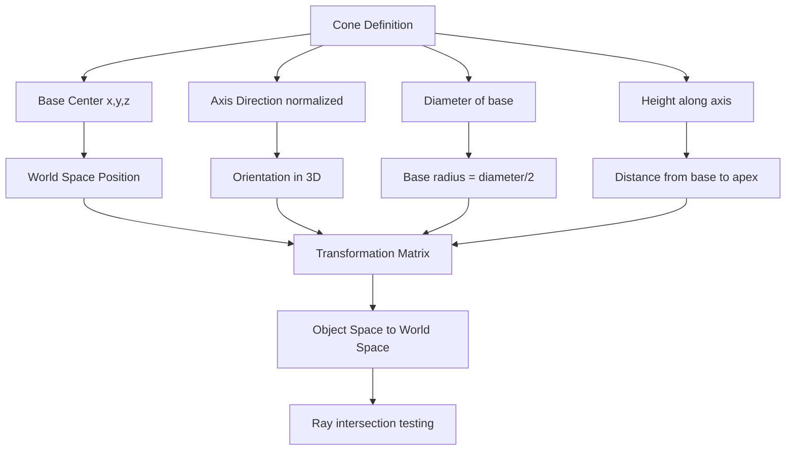

## Mathematical Model

### Cone Equation


### Ray-Cone Intersection
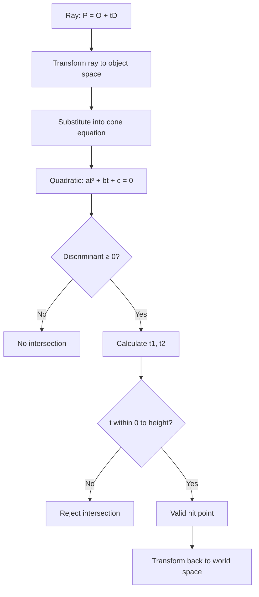

## Implementation Details

### Key Functions

#### 1. parse_cone()
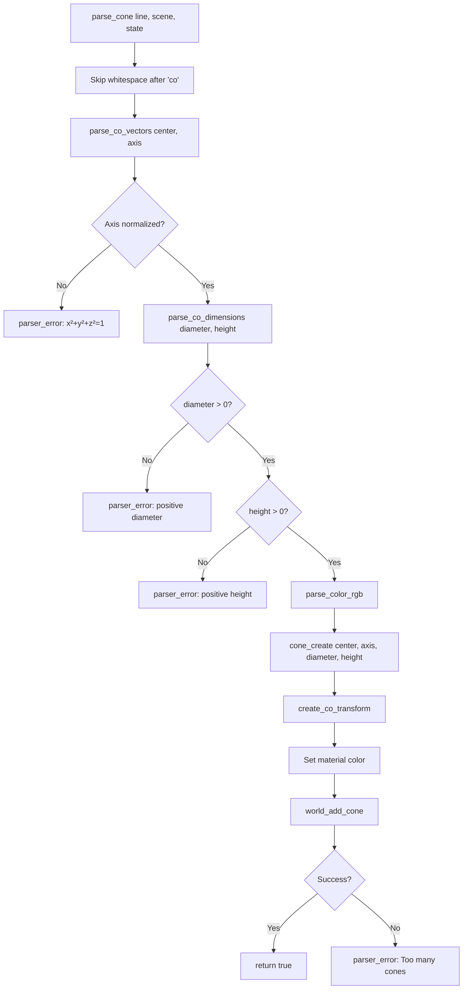

**Location**: `src/parser/parse_cone.c`

**Parameters**:
- **center**: Base center position (x, y, z)
- **axis**: Normalized direction vector (points to apex)
- **diameter**: Base diameter (must be positive)
- **height**: Cone height along axis (must be positive)
- **color**: RGB values (0-255)

#### 2. cone_create()
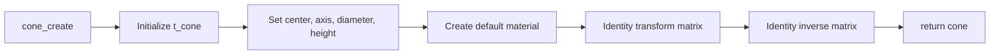

**Location**: `src/cones/cones.c`

**Default Material**:
- color: white (1, 1, 1)
- ambient: 0.1
- diffuse: 0.9
- specular: 0.9
- shininess: 200.0

#### 3. cone_intersect()
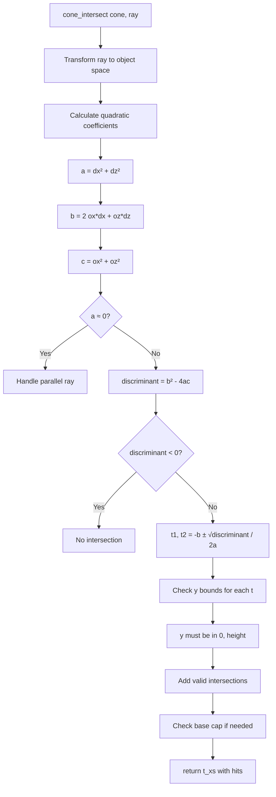

**Location**: `src/cones/cone_intersect.c`

**Algorithm**:
1. Transform ray to cone's object space
2. Solve quadratic equation for ray-cone intersection
3. Check Y bounds (0 to height)
4. Optionally check base cap intersection
5. Return sorted intersection list

#### 4. cone_normal()
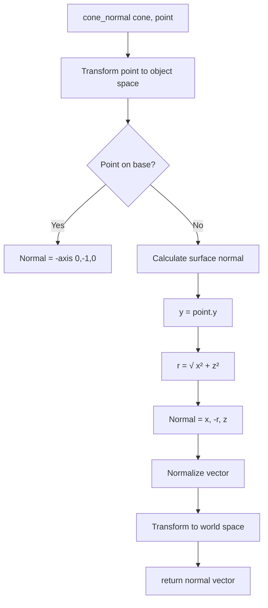

**Location**: `src/cones/cone_normal.c`

**Special Cases**:
- Base cap: normal points downward along -axis
- Side surface: normal perpendicular to surface
- Normal always points outward from cone

#### 5. world_add_cone()
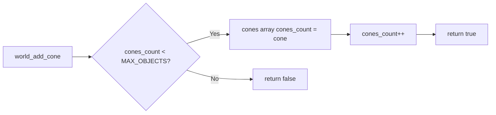

**Location**: `src/world/world_add_object.c`

**Returns**: 
- `true` - cone added successfully
- `false` - MAX_OBJECTS reached

#### 6. intersect_cones()
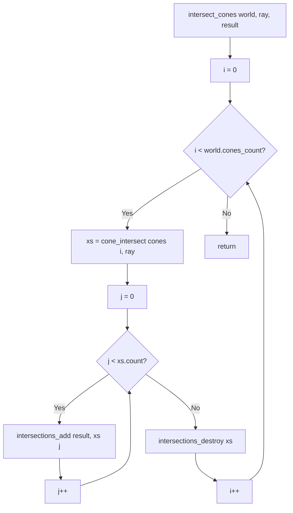

**Location**: `src/world/world_intersect.c`

**Integration**: Called by `intersect_world()` alongside spheres, planes, cylinders

## Scene File Format

### Syntax
```
co x,y,z axis_x,axis_y,axis_z diameter height r,g,b
```

### Parameters
- **x,y,z**: Base center coordinates
- **axis_x,axis_y,axis_z**: Normalized axis vector (must satisfy x²+y²+z²=1)
- **diameter**: Base diameter (positive number)
- **height**: Cone height (positive number)
- **r,g,b**: Color (0-255 per channel)

### Examples
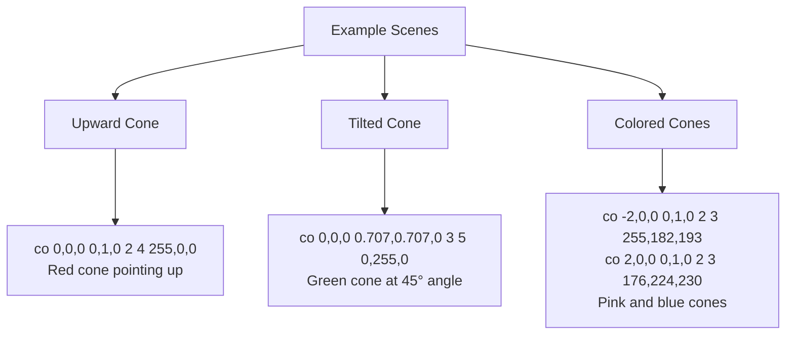

## Transformation Pipeline

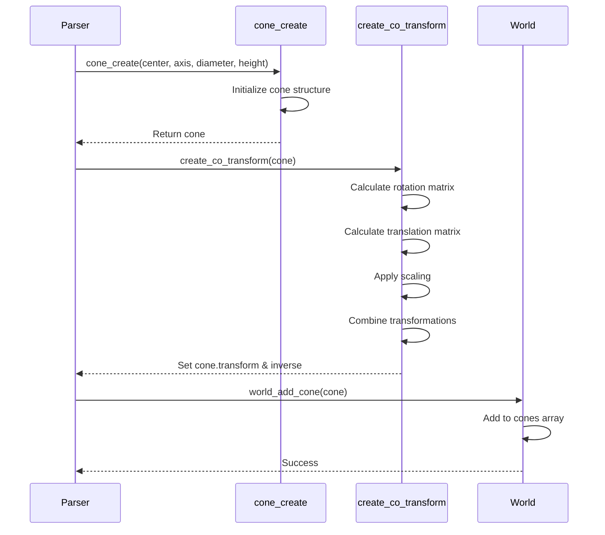

### Transformation Steps
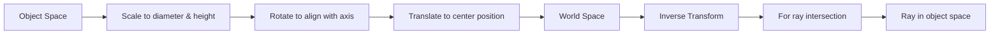

## Rendering Pipeline

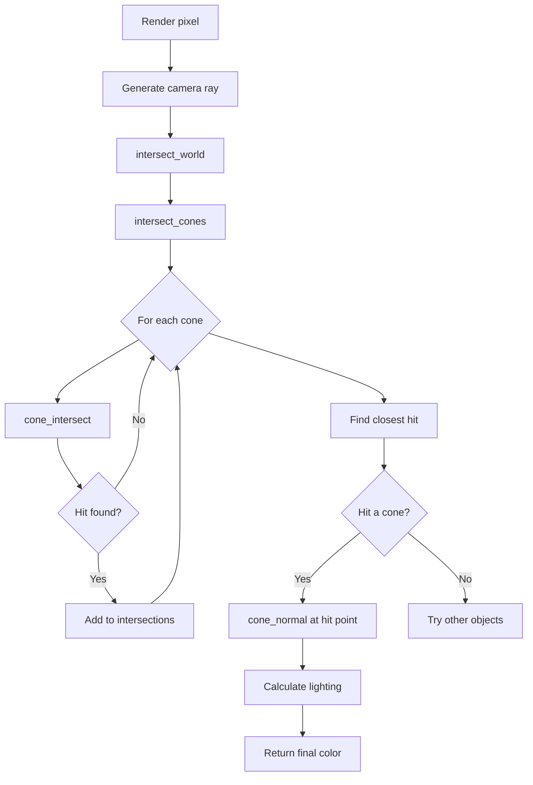

## Visual Representation

### Cone Components
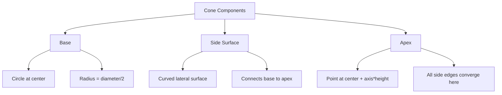

### Coordinate Systems
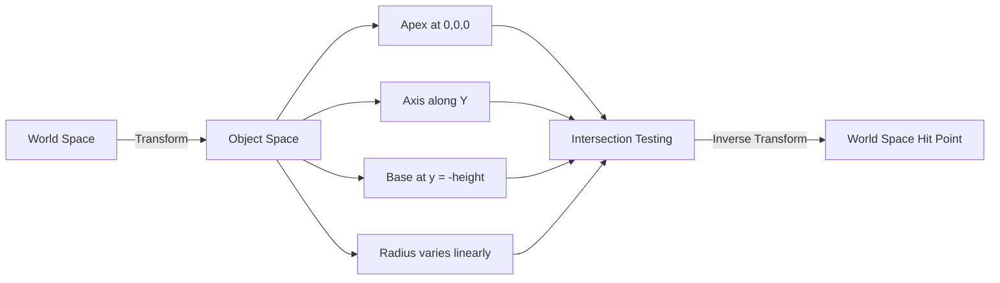

## Testing Scenes

### Single Cone
```rt
A 0.2 255,255,255
C 0,4,-12 0,-0.316228,0.948683 70
L -8,10,-8 0.7 255,255,255

co 0,0,0 0,1,0 2 4 255,0,0
pl 0,-2,0 0,1,0 200,200,200
```

### Multiple Cones (Pastel Colors)
```rt
A 0.3 255,255,255
C 0,6,-18 0,-0.316228,0.948683 70
L -10,15,-10 0.8 255,255,255

co -4,0,2 0,1,0 2.5 5 255,182,193
co 0,0,0 0,1,0 2.8 6 176,224,230
co 4,0,2 0,1,0 2.5 5 255,218,185
pl 0,-2,0 0,1,0 245,245,245
```

### Cone with Multi-Lights
```rt
A 0.1 255,255,255
C 0,8,-20 0,-0.371391,0.928477 70

L -10,12,-10 0.4 255,150,150
L 10,12,-10 0.4 150,150,255
L 0,12,10 0.4 150,255,150

co 0,0,4 0,1,0 2.5 4 255,255,255
pl 0,-2,0 0,1,0 220,220,220
```

## Validation

### Parser Checks
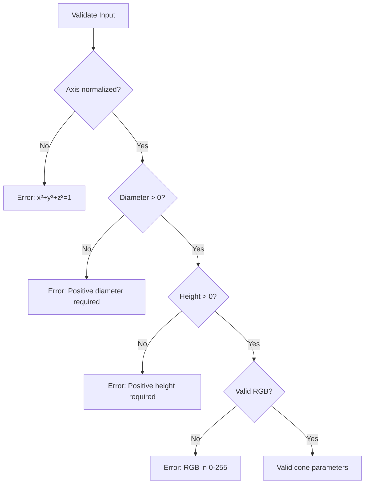

### Runtime Checks
- ✅ Axis vector must be normalized (x²+y²+z²=1)
- ✅ Diameter must be positive
- ✅ Height must be positive
- ✅ RGB values in range [0, 255]
- ✅ Maximum cones limited by MAX_OBJECTS (32)

## Performance Considerations

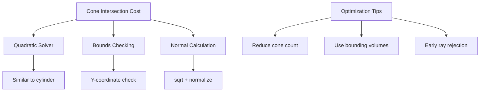

### Complexity
- Ray-cone intersection: O(1) per cone
- Total per pixel: O(n) where n = number of cones
- Similar performance to cylinders

## Integration Points

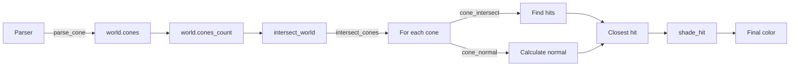

## File Structure

```mermaid
graph TD
    A[Cone Implementation] --> B[src/cones/]
    A --> C[src/parser/]
    A --> D[src/world/]
    A --> E[include/]
    
    B --> F[cones.c<br/>cone_create]
    B --> G[cone_intersect.c<br/>ray intersection]
    B --> H[cone_normal.c<br/>normal calculation]
    
    C --> I[parse_cone.c<br/>parsing logic]
    
    D --> J[world_add_object.c<br/>world_add_cone]
    D --> K[world_intersect.c<br/>intersect_cones]
    
    E --> L[cones.h<br/>type definitions]
    E --> M[world.h<br/>cone array]
```

## Common Pitfalls

```mermaid
mindmap
    root((Cone Issues))
        Axis Vector
            Not normalized
            Zero vector
            Invalid direction
        Dimensions
            Negative diameter
            Negative height
            Zero values
        Transformation
            Wrong rotation
            Incorrect scaling
            Transform order
        Intersection
            Missing base cap
            Wrong Y bounds
            Discriminant handling
```

## Future Enhancements

```mermaid
mindmap
    root((Cone Extensions))
        Geometry
            Truncated cones
            Elliptical base
            Variable radius
        Rendering
            Texture mapping
            UV coordinates
            Bump mapping
        Features
            Cone-cone intersection
            CSG operations
            Cone primitives
        Optimization
            Bounding boxes
            Spatial indexing
            Level of detail
```

## Usage Examples

```bash
# Compile
make re

# Run single cone scene
./miniRT scenes/cone_test.rt

# Run multiple cones (pastel colors)
./miniRT scenes/multi_cones.rt

# Small scene for quick testing
./miniRT scenes/cones_small.rt

# With Valgrind
make run SCENE=scenes/cones_small.rt V=1

# Check norminette
./check_norm.sh | grep cone
```

## Debugging Tips

```mermaid
flowchart TD
    A[Cone not rendering?] --> B{Check parser}
    B -->|OK| C{Check intersections}
    C -->|OK| D{Check normals}
    D -->|OK| E{Check lighting}
    
    B -->|Fail| F[Verify axis normalized]
    F --> G[Print parsed values]
    
    C -->|Fail| H[Test with simple ray]
    H --> I[Verify transform matrix]
    
    D -->|Fail| J[Check normal direction]
    J --> K[Visualize normal vectors]
    
    E -->|Fail| L[Check material properties]
    L --> M[Verify light positions]
```

### Debug Output
- Print cone parameters after parsing
- Verify transformation matrices
- Check intersection t values
- Visualize normal vectors
- Test with simple scenes first
