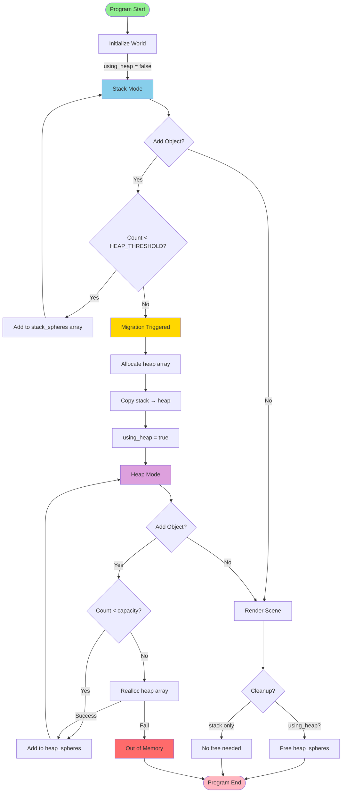
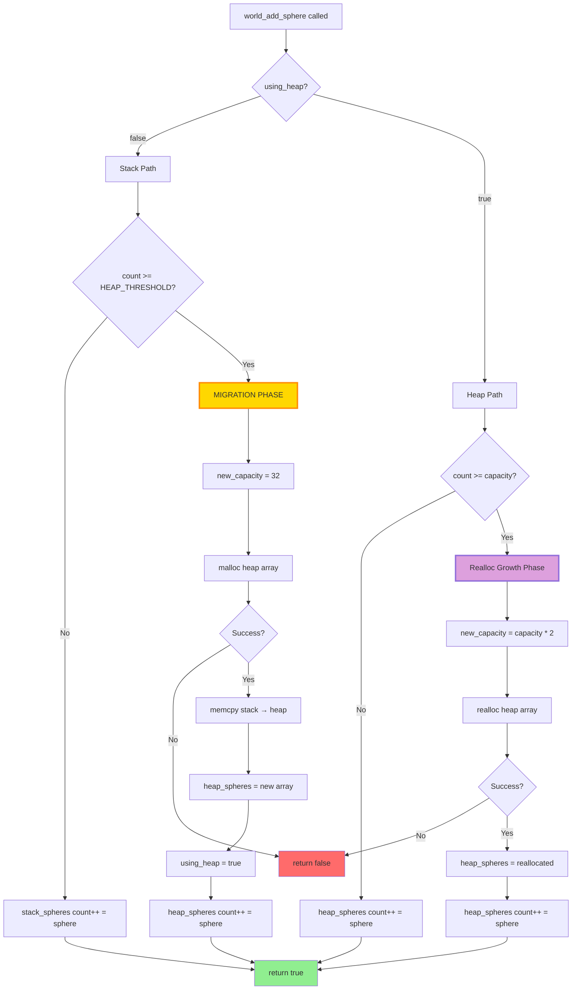
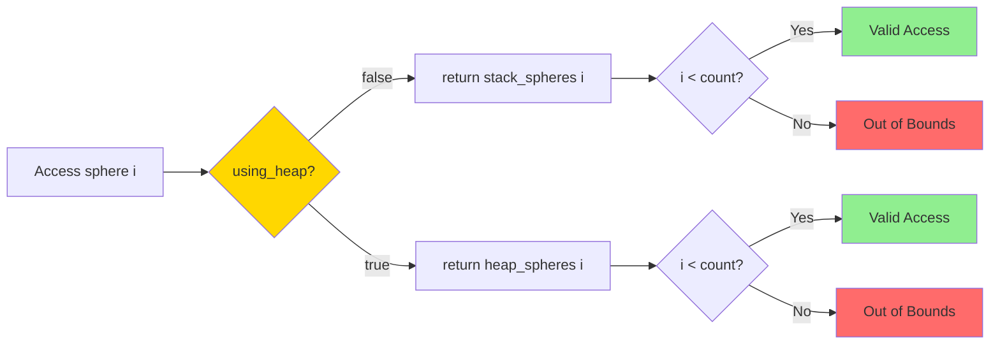
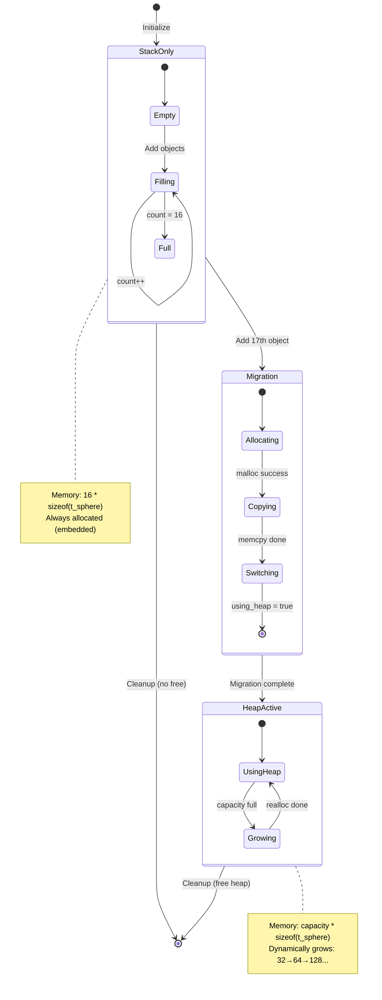
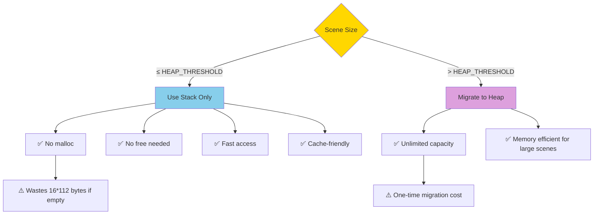
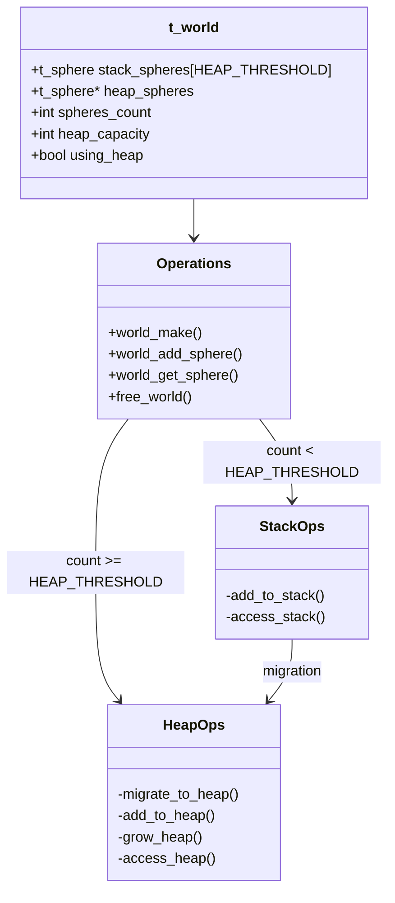

# Hybrid Architecture Flowchart

**Concept:** Use embedded stack array for small objects, transition to heap only when needed.

**Key Feature:** ⚙️ **Configurable HEAP_THRESHOLD** — tune the stack→heap boundary in `include/memory_config.h` (see [Hybrid Heap Transition](hybrid-heap-transition.md) for details).

---

## Configuration

```c
// include/memory_config.h
#define HEAP_THRESHOLD 16  // ⚙️ Change this to tune behavior
```

**Impact:**
- `HEAP_THRESHOLD = 8` → migrate at 9th object
- `HEAP_THRESHOLD = 16` → migrate at 17th object (default)
- `HEAP_THRESHOLD = 32` → migrate at 33rd object

All diagrams below use **HEAP_THRESHOLD** as the boundary value.

## High-Level Flow



## Detailed Add Object Flow



## Access Pattern Flow



## Memory State Transitions



## Decision Points

### When to use Stack vs Heap?



## Comparison: Stack, Heap, Hybrid

```mermaid
graph LR
    subgraph Pure Stack
        S1[Fixed Array 100]
        S2[Always 11.2 KB]
        S3[Hard Limit]
    end
    
    subgraph Pure Heap
        H1[Dynamic from start]
        H2[Grows: 0→4→8→16...]
        H3[Unlimited]
    end
    
    subgraph Hybrid
        HY1[Stack: 0-16 objects]
        HY2[Heap: 17+ objects]
        HY3[Best of Both]
    end
    
    Pure Stack --> |✅ Simple| Trade1[❌ Wastes memory]
    Pure Heap --> |✅ Flexible| Trade2[❌ Malloc overhead]
    Hybrid --> |✅ Fast small scenes| Trade3[❌ More complex code]
    
    style Hybrid fill:#FFD700,stroke:#FF8C00,stroke-width:3px
```

## Performance Characteristics

### Memory Usage Comparison (Objects → Memory)

```
Objects:    0      5      10     T      T+1    20     30     50     100
                                 ↓      ↓                            
Stack:    11.2K  11.2K  11.2K  11.2K  11.2K  11.2K  11.2K  11.2K  [FAIL]
Heap:     0      0.4K   0.4K   0.4K   0.9K   0.9K   1.8K   3.6K   7.2K
Hybrid:   1.8K   1.8K   1.8K   1.8K   3.6K   3.6K   3.6K   7.2K   14.4K
          ↑                             ↑
       Embedded                    Migration point (T = HEAP_THRESHOLD)

Legend: T = HEAP_THRESHOLD (default: 16)
```

### Operation Costs

| Operation | Stack | Heap (Pure) | Hybrid |
|-----------|-------|-------------|--------|
| Add (1-T) | O(1) | O(1) amortized | O(1) — stack |
| Add (T+1) | FAIL | O(1) amortized | O(n) — one-time migration, then O(1) |
| Access | O(1) | O(1) | O(1) — with flag check |
| Memory for 10 | 11.2 KB | ~1 KB | 1.8 KB (embedded) |
| Memory for 100 | FAIL | ~14 KB | ~14 KB |

Note: T = HEAP_THRESHOLD (configurable, default: 16)

## Code Structure Overview



## Modular Code Organization

**For easy stack-only mode:** Isolate all heap logic in separate directory.

```
src/world/
├── world_common.c       # Shared code
├── world_stack.c        # Pure stack (STRATEGY_STACK)
└── heap/                # ← Delete this folder for pure stack!
    ├── world_hybrid.c   # Hybrid add/access
    ├── heap_migrate.c   # Migration logic
    └── heap_grow.c      # Realloc logic

include/
└── memory_config.h      # ⚙️ Set HEAP_THRESHOLD or disable heap
```

**To disable heap:**
1. Edit `memory_config.h`: `#define STRATEGY_STACK`
2. Delete `src/world/heap/` directory (optional)
3. Recompile → pure stack implementation!

## See Also
- [Hybrid Heap Transition Plan](hybrid-heap-transition.md) — Implementation roadmap with HEAP_THRESHOLD configuration
- [Architecture Comparison](architecture-comparison.md) — Detailed benchmark and decision guide
- [Full Heap Migration](heap-transition.md) — Alternative approach (pure heap)
- [Memory Management](memory-management.md) — Leak detection

---

*Hybrid architecture flowchart for miniRT. Combines stack speed with heap flexibility. Configure HEAP_THRESHOLD to tune behavior.*
