# Multi-Light Support Documentation

## Overview
Multi-light support allows rendering scenes with multiple light sources, each contributing to the final illumination of objects. This creates more realistic and dynamic lighting effects.

## Architecture

### Data Flow
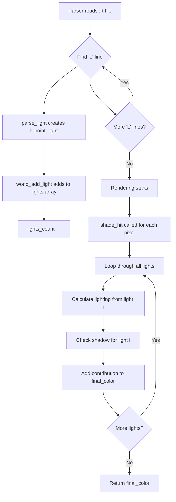

### Structure Modifications
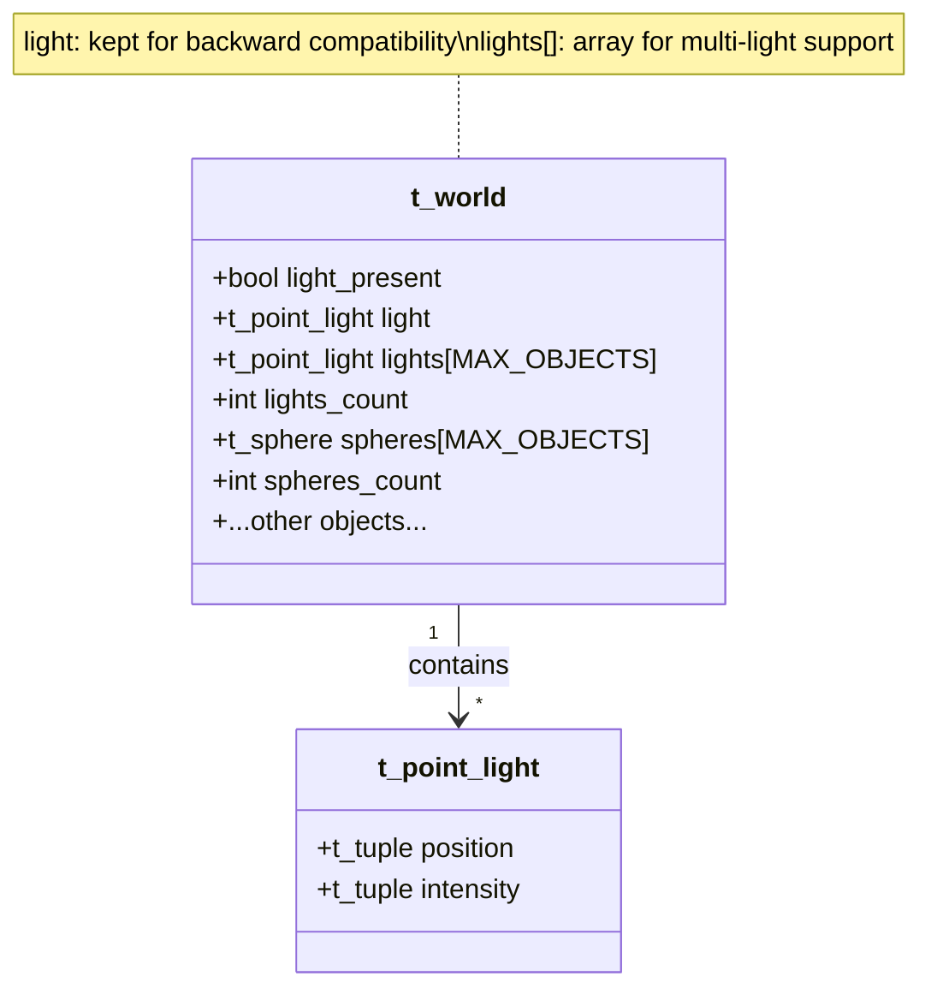

### Rendering Pipeline
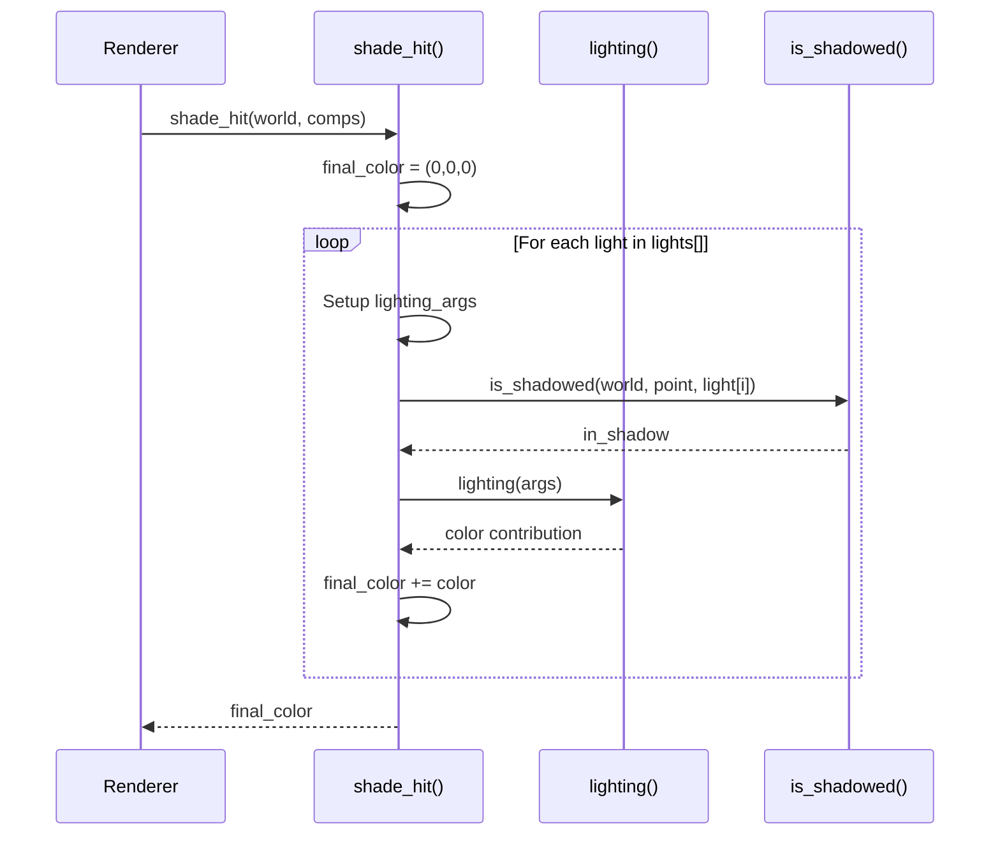

## Implementation Details

### Key Functions

#### 1. world_add_light()
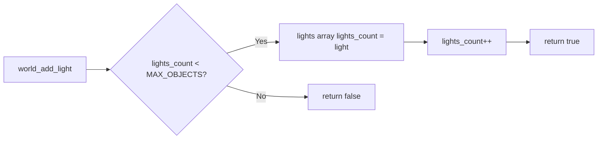

**Location**: `src/world/world_add_object.c`

**Purpose**: Add a new light source to the world

**Returns**: 
- `true` - light added successfully
- `false` - MAX_OBJECTS reached

#### 2. parse_light()
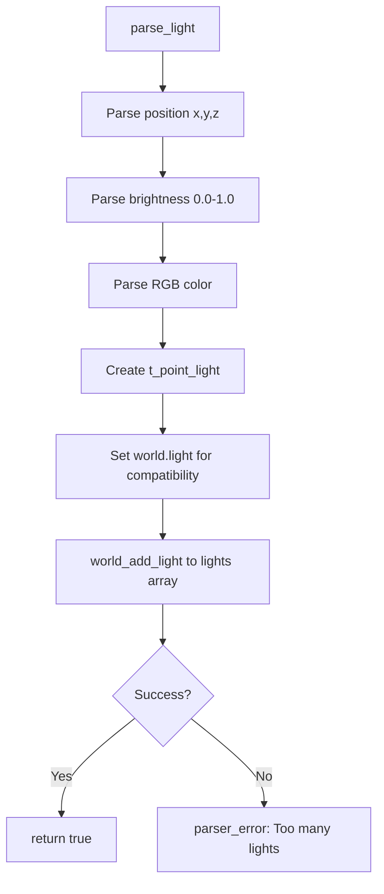

**Location**: `src/parser/parse_light.c`

**Behavior**: 
- No longer limited to one light
- First light sets `world.light` (backward compatibility)
- All lights added to `lights[]` array

#### 3. shade_hit()
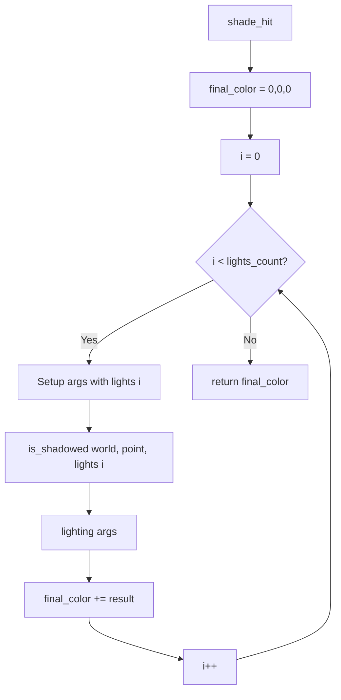

**Location**: `src/computations/computations.c`

**Algorithm**:
1. Initialize final color to black (0,0,0)
2. For each light in `lights[]`:
   - Check if point is in shadow from this light
   - Calculate lighting contribution
   - Add to final color
3. Return accumulated color

#### 4. is_shadowed()
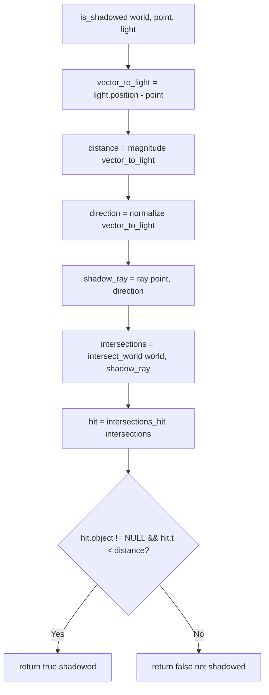

**Location**: `src/world/world.c`

**Changes**: Now takes specific `light` parameter instead of using `world.light`

## Scene File Format

### Single Light (Mandatory)
```
L x,y,z brightness r,g,b
```

### Multiple Lights (Bonus)
```
L -10,10,-10 0.7 255,255,255
L 10,10,-10 0.5 255,100,100
L 0,10,10 0.5 100,100,255
```

### Parameters
- **x,y,z**: Light position in 3D space
- **brightness**: Light intensity ratio (0.0 to 1.0)
- **r,g,b**: Light color (0 to 255 per channel)

## Color Mixing

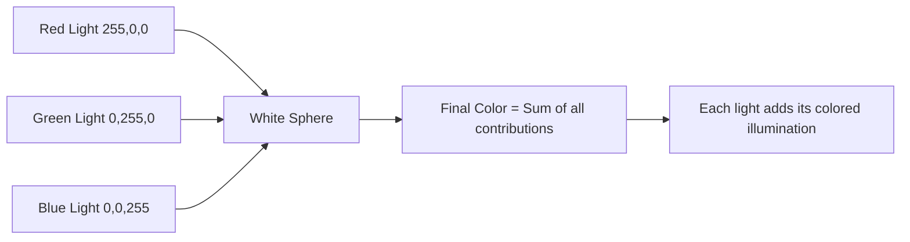

### Example Results
- 3 equal white lights → Brighter white surface
- Red + Green + Blue lights → RGB color mixing on surface
- Positioned lights → Different shadows from each source

## Memory Layout

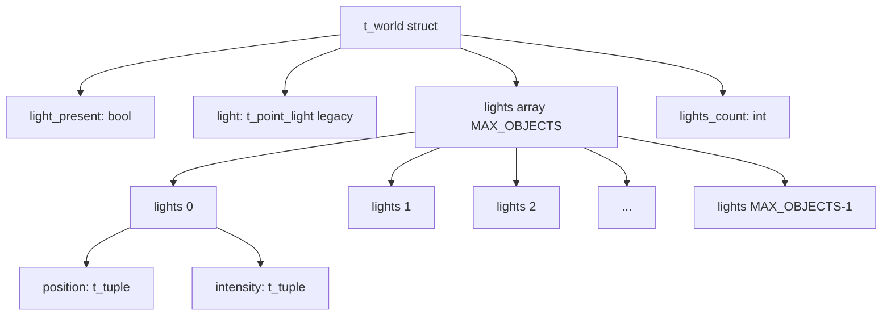

## Performance Considerations

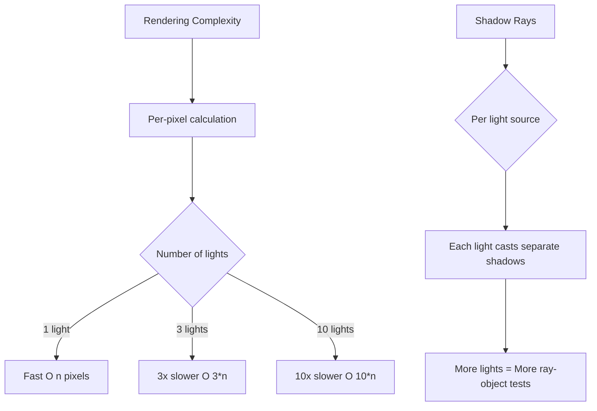

### Optimization Notes
- Each additional light increases rendering time linearly
- Shadow calculation performed separately for each light
- Consider reducing resolution for multi-light testing

## Testing Scenes

### Basic Test (2 lights)
```
A 0.2 255,255,255
C 0,0,-10 0,0,1 70
L -5,5,-5 0.6 255,255,255
L 5,5,-5 0.6 255,255,255
sp 0,0,0 2 255,0,0
pl 0,-2,0 0,1,0 150,150,150
```

### RGB Color Mix (3 lights)
```
A 0.1 255,255,255
C 0,8,-20 0,-0.371391,0.928477 70
L -10,12,-10 0.4 255,0,0
L 10,12,-10 0.4 0,255,0
L 0,12,10 0.4 0,0,255
sp 0,0,0 3 255,255,255
```

## Integration Points

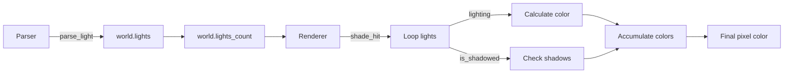

## Backward Compatibility

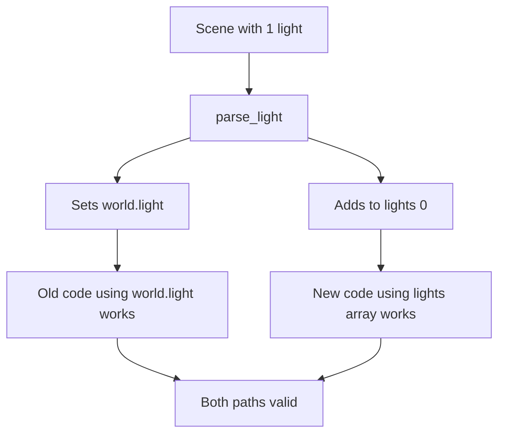

- `world.light` still exists for backward compatibility
- First light in scene sets both `world.light` and `lights[0]`
- Rendering uses only `lights[]` array

## Future Enhancements

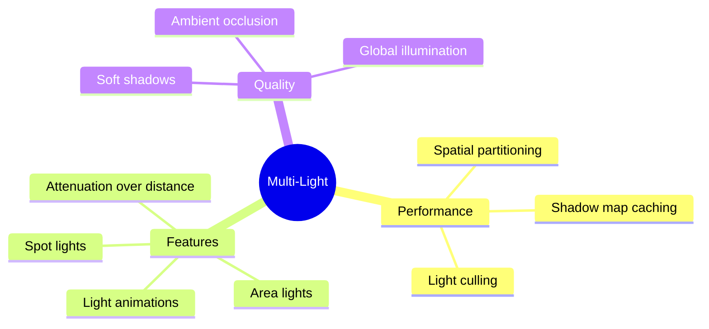

## Usage Example

```bash
# Single light (mandatory)
./miniRT scenes/simple_test.rt

# Multiple lights (bonus)
./miniRT scenes/multilights.rt
./miniRT scenes/rgb_lights.rt

# With Valgrind (slower with multiple lights)
make run SCENE=scenes/cones_small.rt V=1
```

## Validation

### Parser Checks
- ✅ Brightness must be in range [0.0, 1.0]
- ✅ RGB values must be in range [0, 255]
- ✅ Position coordinates must be valid floats
- ✅ Maximum lights limited by MAX_OBJECTS (32)

### Runtime Checks
- ✅ Each light checked independently for shadows
- ✅ Color contributions clamped to valid RGB range
- ✅ Light array bounds checked in world_add_light()

## Error Handling

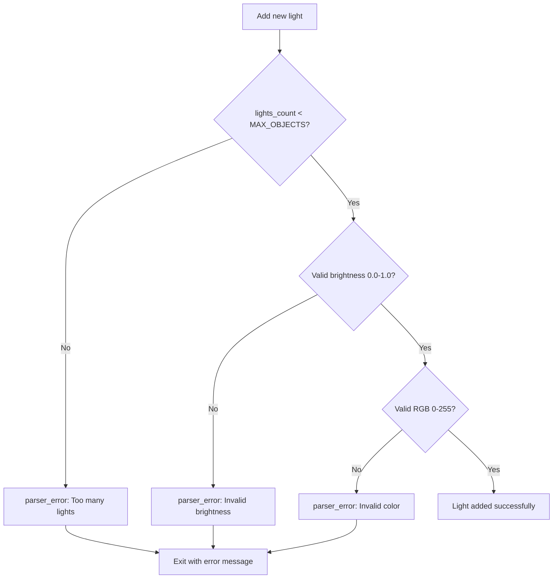
