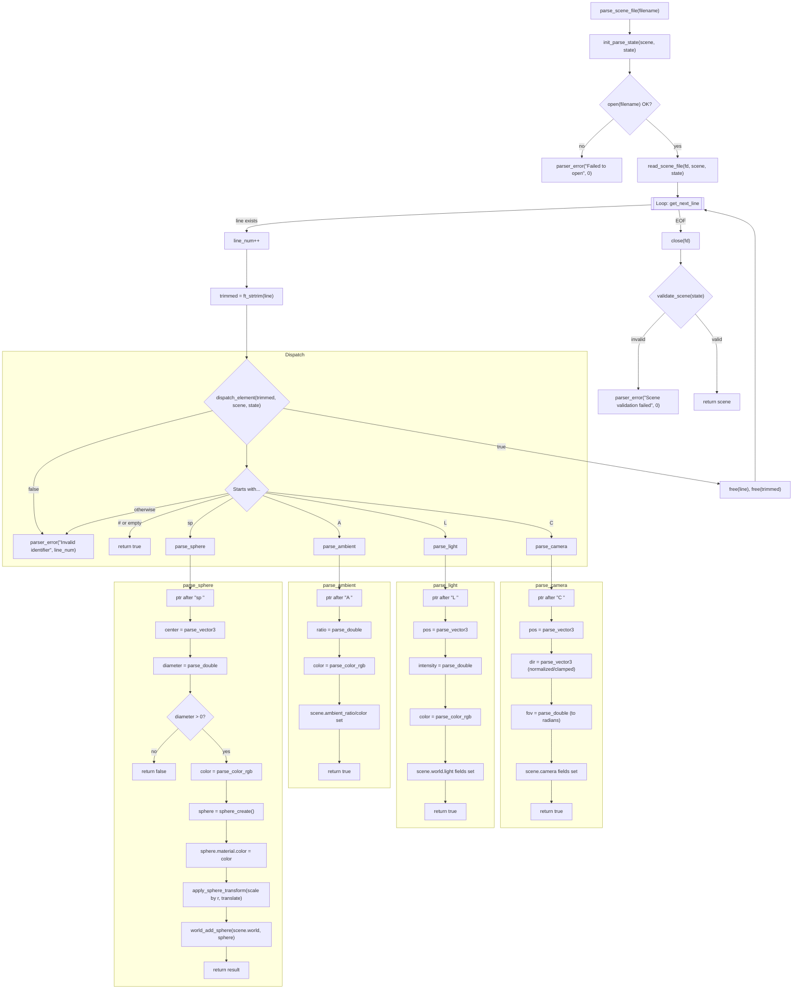

# Parser Architecture

This document describes the scene parser flow used in miniRT.

## High-level flow (Mermaid)

## Component Descriptions

* `parse_scene_file`: The main orchestrator function. It sequentially performs: state initialization (`init_parse_state`), file opening, initiating the read loop (`read_scene_file`), closing the file (`close(fd)`), and final scene validation (`validate_scene`). Returns the complete scene on success.
* **Read Loop** (`Loop: get_next_line`): The core loop that processes the file line by line. In each iteration, it increments the line counter, trims whitespace, and passes the line to `dispatch_element`.
* `dispatch_element`: A router that inspects the start of the line to determine the object type (`A`, `C`, `L`, `sp`). Empty lines and comments (`#`) are handled and ignored. An error is triggered if the identifier is unrecognized.
* **Parsing Functions** (`parse_ambient`, `parse_camera`, `parse_light`, `parse_sphere`): These functions are responsible for reading and converting data (like coordinates, colors, and angles) from the string and storing them into the appropriate fields of the `scene` and `world` structs. `parse_sphere` also creates geometry, applies transformations, and adds the final object to the world.
* `parser_error`: The error handling function. It prints an informative message (optionally including the line number) and exits the program cleanly.
* `validate_scene`: The final check of the scene. It ensures that all mandatory elements are defined: one ambient component (`A`), one camera (`C`), and at least one light source (`L`). It triggers an error otherwise.

> **Tip**: VS Code can render Mermaid diagrams in Markdown preview. GitHub also supports Mermaid in Markdown files.

[^1]: https://docs.mermaidchart.com/mermaid-oss/syntax/flowchart.html

[^2]: https://mermaid.js.org/intro/syntax-reference.html

[^3]: https://docs.mermaidchart.com/mermaid/flowchart/syntax

[^4]: https://emersonbottero.github.io/mermaid-docs/syntax/flowchart.html

[^5]: https://www.freecodecamp.org/news/use-mermaid-javascript-library-to-create-flowcharts/

[^6]: https://www.mintlify.com/docs/components/mermaid-diagrams

[^7]: https://mermaid.js.org/intro/

[^8]: https://docs.github.com/en/get-started/writing-on-github/working-with-advanced-formatting/creating-diagrams

[^9]: https://www.jetbrains.com/help/writerside/mermaid-diagrams.html

[^10]: https://mermaid.js.org/config/usage.html

